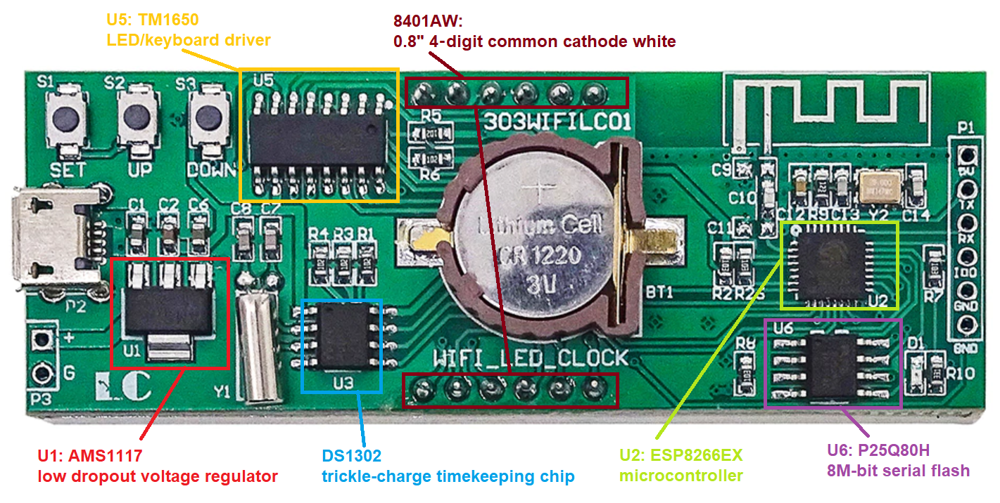
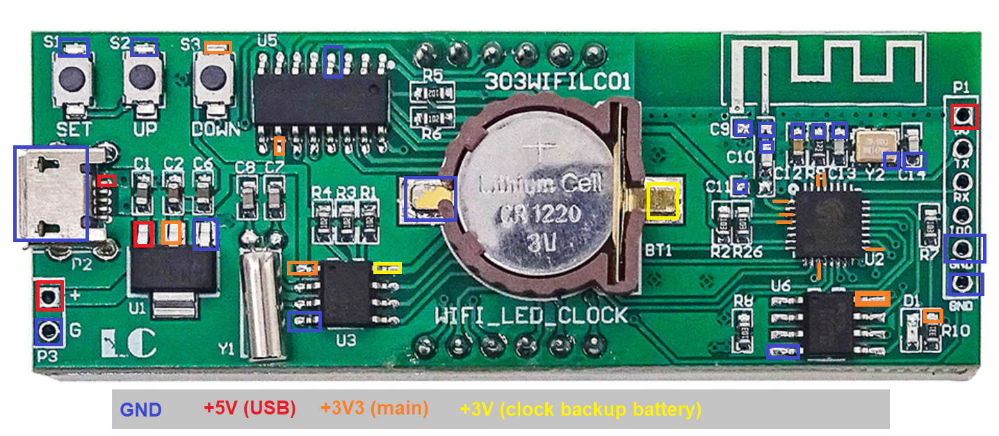

# PCB analysis of the 303WIFILC01 clock

Analyze the 303WIFILC01 clock board.

## First impressions

The product (PCB) has no branding
 - Board ID: 303 WIFI LC 01
 - Name: WIFI_LED_CLOCK
 - Brand: LC
 - Shop: [AliExpress CFsunbird Store](https://www.aliexpress.com/item/1005003486084193.html)
 - Documentation: [best found](https://dailystuffstore.com/display-screen/707-1903820-0-8-inch-display-screen-digital-tube-wifi-clock-module-automatic-clock-diy-digital.html)

Notes
 - The back has a "header" P1 that can be connected to a USB-serial adapter.
 - The labels for P1 are confusing; they are _below_ the holes.
 - The P1 5V is indeed a 5V - i.e. connected to + on power header P3 or the 5V of the USB connector.
 - S1 needed extra soldering (top contact was loose) on two different boards.

## User parts

The board features

 - Three general purpose buttons (S1, S2, S3); connected to ESP8266.
 - One general purpose red LED (D1); connected to ESP8266.
 - A programming header for the ESP8266 (P1); reset signal is missing.
 - PCB trace antenna for the ESP8266.
 - A 4 digit 7 segment display with colon.
 - Micro USB (P2) for powering the board; there is no on-bard USB-to-serial chip, so no flashing or serial access to ESP8266.
 - Alternative (P3) 5V power supply.
 - A holder (BT1) for a 3V battery for the time keeping chip (U3).

 

## Components

 - U1: AMS1117 low dropout voltage regulator
   -- [datasheet](http://www.advanced-monolithic.com/pdf/ds1117.pdf).

 - U2 : ESP8266EX microcontroller 
   -- [datasheet](https://www.espressif.com/sites/default/files/documentation/0a-esp8266ex_datasheet_en.pdf).

 - U3: DS1302 Trickle-Charge Timekeeping Chip
   -- [datasheet](https://eu.mouser.com/datasheet/2/256/DS1302-1292062.pdf).

 - U4: not present

 - U5: LED drive controller / keyboard scan ASIC TM1650
   -- [chinese datasheet](https://datasheetspdf.com/pdf-file/840047/TitanMicro/TM1650/1),
   [page](https://components101.com/ics/tm1650-led-driver-ic) with link to datasheet translated to English,

 - U6: P25Q80H Ultra Low Power, 8M-bit Serial Multi I/O Flash Memory
   -- [datasheet](https://datasheet.lcsc.com/szlcsc/PUYA-P25Q80H-SSH-IT_C194872.pdf).

 - display: 8401AW: 0.8" 4 digit common cathode white
   -- close but not correct [8401**C**W](http://www.yitenuo.com/product/display/four/ELF-8401C-D.html) or
   [840**2**AW](http://www.yitenuo.com/product/display/four/ELF-8402.html).
   Looks like [these](https://www.aliexpress.com/item/32945496377.html).
   
   

## Power domains

  

## GPIO nets

  

In words:

 - GPIO2 outputs LED D1 (low active)
 - GPIO0 inputs switch S1 (low active) also to P1.IO0
 - GPIO4 inputs switch S2 (low active)
 - GPIO15 inputs switch S3 (high active)
 - GPIO13 is "SDA" for TM1650 (not real I2C)
 - GPIO12 is "SCL" for TM1650 (not real I2C)

(end)
  
