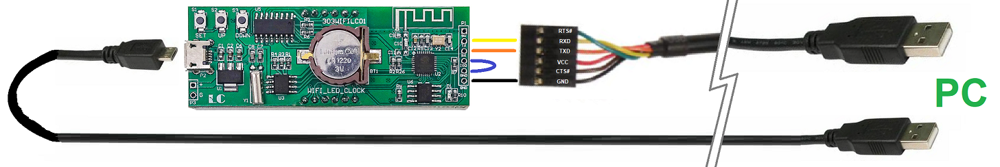

# Firmware backup of the 303WIFILC01 clock

This page explains how I made a backup of my 303WIFILC01 clock.


## Introduction

I found on a [dutch site](http://domoticx.com/esp8266-wifi-firmware-backup-maken/)
how to make a backup of an ESP8266. That is what I describe here.


## Get PC software

 - Ensure you have an upto date Python (I have 3.9)
 - Make a virtual env (if you want)
 - install packages `pyserial`, and `esptool`
 - esptool is now in `env\Lib\site-packages\esptool.py`

If you have python (3.9) installed on a windows PC, you can just run [`setup.bat`](setup.bat)


## Connect 303WIFILC01 clock to PC

 - Get an USB-serial bridge with 3V3 IO voltage.
   I used an [FTDI cable](https://ftdichip.com/products/ttl-232r-3v3).
 
 - Wire P1 port of the 303WIFILC01 to the FTDI
   - Connect P1.GND to FTDI.GND
   - Connect P1.RX to FTDI.TX
   - Connect P1.TX to FTDI.RX
   - Connect P1.IO0 to P1.GND (this ensures that a boot goes into the bootloader instead of the app).
   - I did not connect VCC, that will come via USB (see next step).

 - Connect to PC
   - Connect clock.USB to the PC.
     This boots the clock, but since IO0 is grounded, it boots into the boot loader.
   - Connect FTDI.USB to the PC.




## Make backup  

Find the FTDI COM port in Device Manager (for me it is `COM12`).
Then make a backup of the entire flash memory.

Since my FTDI is on port 12, and since thew flash is 1M  byte (8M bit), I use this command.
It is also available as `run.bat`.

```cmd
python  env\Lib\site-packages\esptool.py  --port COM12  --baud 115200  read_flash 0x0000 1048576  backup.bin
```

```text
You might have to update the --port argument

esptool.py v3.3
Serial port COM12
Connecting....
Detecting chip type... Unsupported detection protocol, switching and trying again...
Connecting...
Detecting chip type... ESP8266
Chip is ESP8266EX
Features: WiFi
Crystal is 26MHz
MAC: 40:f5:20:23:3c:68
Uploading stub...
Running stub...
Stub running...
1048576 (100 %)
1048576 (100 %)
Read 1048576 bytes at 0x0 in 98.8 seconds (84.9 kbit/s)...
Hard resetting via RTS pin...

Done
```

I ran this script (on a non-virgin board; I messed around with the WiFi passwords).
The `backup.bin` is in the [repo](backup.bin).

## Restore backup

```cmd
python  env\Lib\site-packages\esptool.py  --port COM9  --baud 115200  write_flash 0x0000 backup.bin
```

(end)
  
