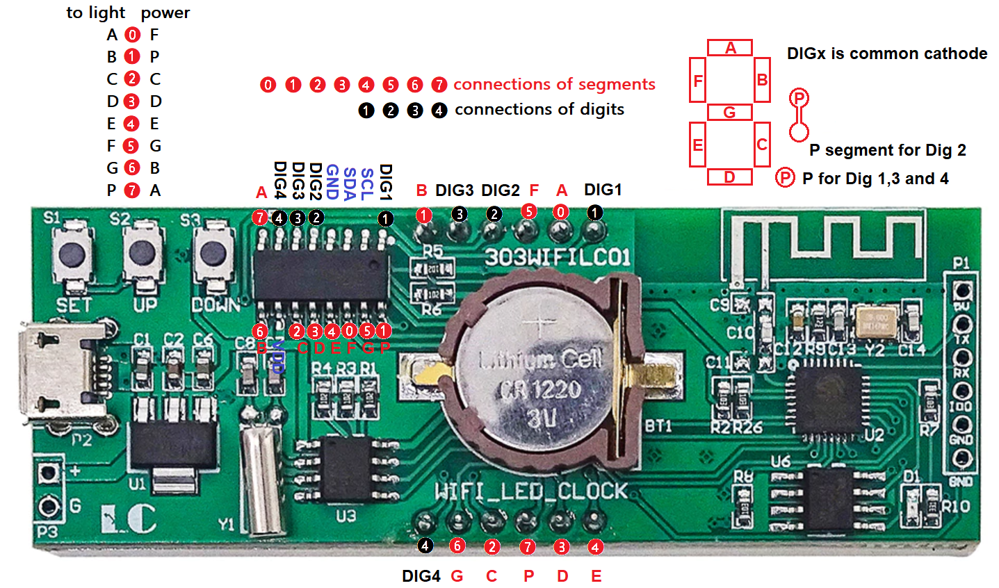
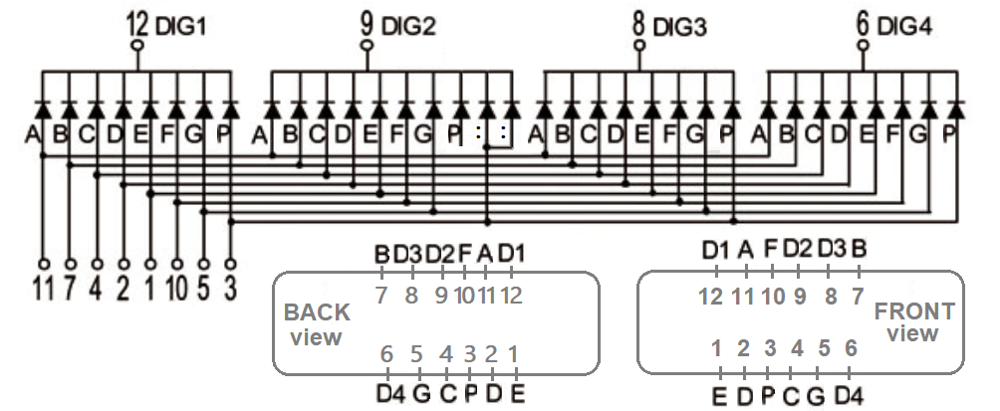
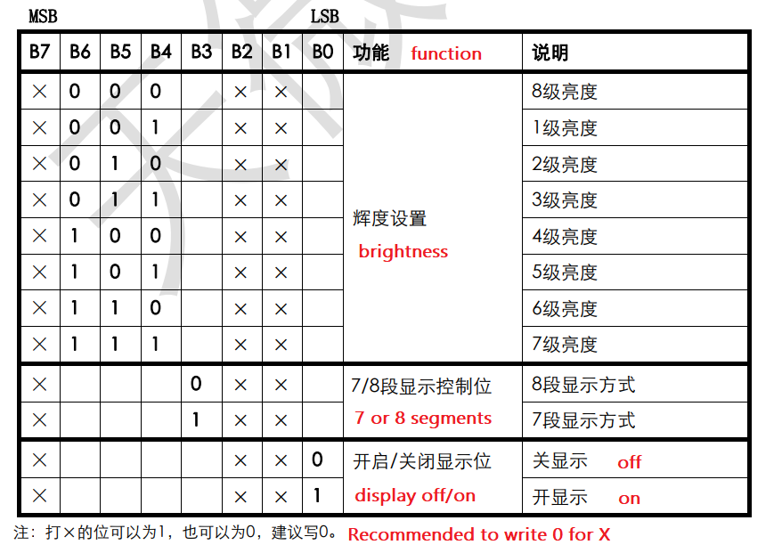
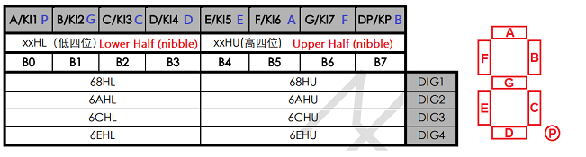
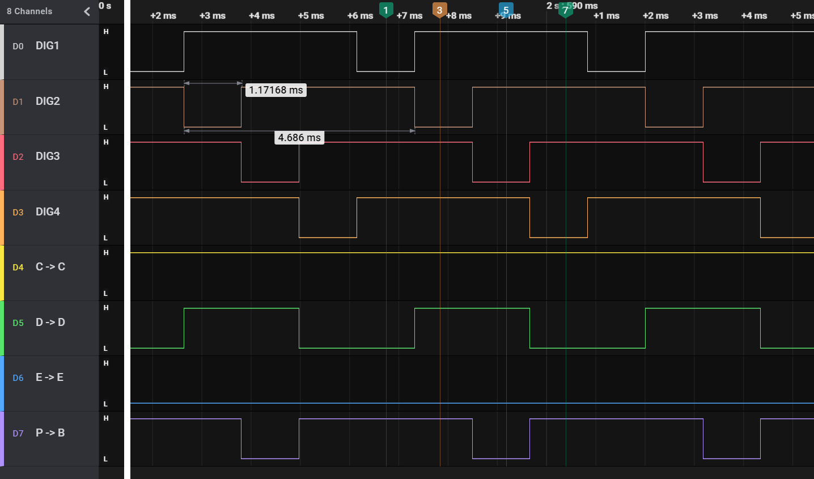
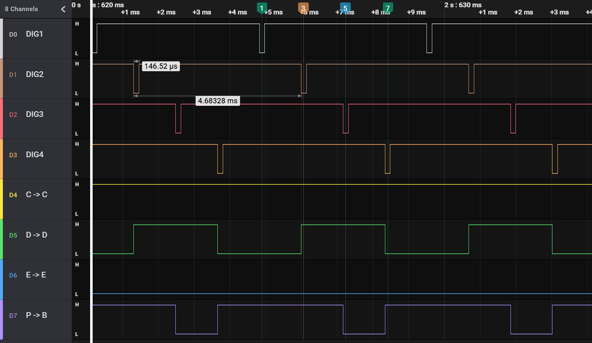
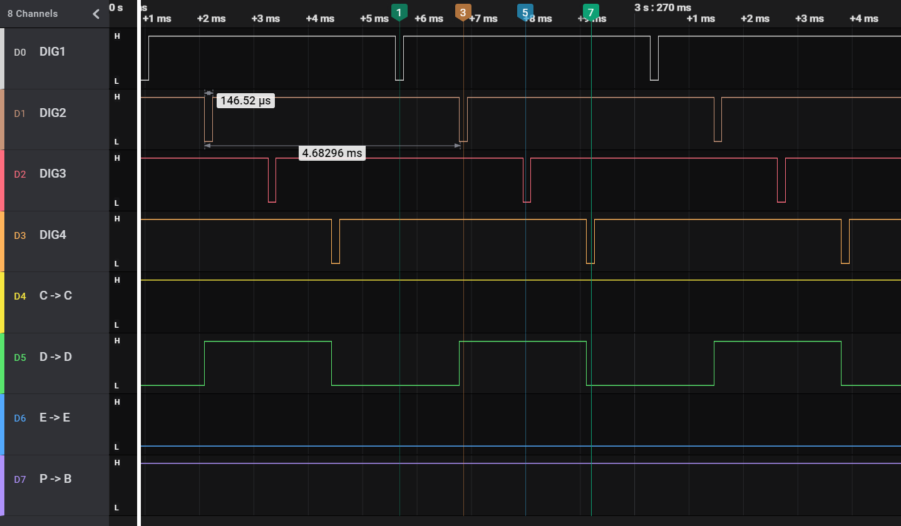

# PCB analysis of the 303WIFILC01 clock

Reverse engineering the display control of the 303WIFILC01 clock.


## TM1650

First, I checked the pinning of the TM1650.
The datasheet is Chinese (I could only find bot-translated English versions).
However, determining the pin-out from the [Chinese datasheet](https://datasheet.lcsc.com/lcsc/1810281208_TM-Shenzhen-Titan-Micro-Elec-TM1650_C44444.pdf)
is not hard.

In the photo below, the DIGx pins of the TM1650 are labeled in black.
Those are the common cathode pins of the 4 digits.
In red, find the segment pins A, B, C, D, E, F, G and P (decimal point).
In blue the other connections (power and I2C).




## Display

Above and below the battery, the pins of the display are located.
I could not find (a datasheet of) the display.
It has marking `FJ8401AW`; my guess is that
 - `FJ` indicates the manufacturer.
 - `8_0` indicates the size: 0.80 inch.
 - `4` indicates the number of digits.
 - I don't know what the `1` means, it is maybe an indication of which dots
   (decimal point, colon) are wired.
 - The `A` means common cathode (a `B` would mean common anode).
 - `W` is for white (O for orange, Y for Yellow, G for green, B for blue and somehow S for red).

For example [ELT5361BY](http://www.yitenuo.com/product/display/three/ELT-5361.html) is
a 0.56 inch 3-digit Yellow  common Anode display from Etnel LED Technology.

I believe the internal schematics of the display, and the pinning is as follows.
DIG1, DIG2, DIG3 and DIG4 are the common cathode pins of the four digits.
The segment pins are labeled A, B, C, D, E, F, G and P (decimal point).
Note the DIG2 digit does have a "decimal point", but it is not connected.
Its P is wired to the two dots of the colon.



I have confirmed this on the 303WIFILC01 board (with a current and voltage limited probe).

The photo in the first section also shows the display pin-out, and it has a diagram of the which segment is A-G or P.


## Connection

The TM1650 and the display are made for each other. Both have 4 common cathodes (DIG1..DIG4) and 8 segments (A-G,P).
I would expect that the corresponding pins are connected, **but they are not**.

I probed the TM1650 pins and the display pins to see which is connected to which.
The photo in the first section has that indicated with the encircled numbers:
black ❶❷❸❹ (for the common cathode of the digits) and red ⓿❶❷❸❹❺❻❼ (for the segments).

We observe that the DIG pins are connected as expected, 
and also segments CDE, but segments ABFGP are mixed.

 | to light segment | power TM1650 pin |
 |:----------------:|:----------------:|
 |          A       |       F          |
 |          B       |       P          |
 |          C       |       C          |
 |          D       |       D          |
 |          E       |       E          |
 |          F       |       G          |
 |          G       |       B          |
 |          P       |       A          |

This is confusing but not a big problem: it just means that we need to be careful when
addressing segments in software.


## Datasheet

The [Chinese datasheet](https://datasheet.lcsc.com/lcsc/1810281208_TM-Shenzhen-Titan-Micro-Elec-TM1650_C44444.pdf)
gives us the following key points (focus on display; ignoring support for key scan):

 - The device is "semi" I2C. 
   It is I2C in the sense that it requires a _start_ and _stop_ condition, and in between those, bytes are sent. 
   It is not I2C because the device itself has no I2C address, it needs to be on a bus by its own.
   It borrows from I2C that it has registers that the host (ESP8266) should write to,
   and those registers have a (one byte) address.
   
 - There is one system _control_ register and four _data_ registers.
   
 - The control register is at location 48H (0x48), it determines whether the display is on or off, 
   whether a 7 or 8 segment display is attached, and what brightness to use.
   
   

   Observe that 000 is tagged as brightness 8 in the datasheet - think of this as (1)000.

   I believe the 7/8 segments settings changes the timing of the digit/segment control:
   mode 7 has one segment less (P is always on).
   
   A write of 0b0101_0001 to 0x48 configures the display to have brightness 5, 8 segments and power On.
   
 - Since the device does not have an address itself, the example configuration needs a transaction
   of the form `START 48 51 STOP`. In the Arduino Wire API, we need to begin a transaction 
   by passing the _device_ address. For TM1650 we simply pass the _register_ address instead.
   However, a device address is 7 bits and it is appended with a 0 for write. 
   So we need to pass 0x24 to get 0x48 on the line.
   
   ```C++
   Wire.beginTransmission(0x24); // register 0x48
   Wire.write(0x51);
   Wire.endTransmission();
   ```

 - Fortunately all TM1650 registers are _even_
   so the trick to replace the device address
   by the register address always works.

 - For displaying content there is a _data_ register per digit.
 
 - The data registers for digits 1 to 4 are at address 0x68, 0x6A, 0x6C and 0x6E (this is overly verbose in the datasheet).

   
   
   This table does show an important property, namely that bits 0, 1, 2, 3, 4, 5, 6, and 7
   map to segments A, B, C, D, E, F, G, respectively P - as one would expect.
   But our board is wired in different way. The blue labels in the header show where the bits 
   map to in the 303WIFILC01 board.
 
 - To write a `0` digit to the display, we need to power segments A, B, C, D, E, and F, so that
   is the (blue) bits 0b1111_1100 or 0xF3:

   ```C++
   Wire.beginTransmission(0x34); // register 0x68
   Wire.write(0xF3);
   Wire.endTransmission();
   ```


## Software

To test my understanding of the datasheet and the analysis of the board, I have written 
an Arduino [sketch](dispself) which controls the TM1650 directly, no longer using a standard driver.
It has a small command interpreter, enter `b`, `m`, or `p` over serial to step the
brightness, mode78, or power of the _control_ register. The _data_ register is fixed to `13:57.`

I tested this with a logic analyzer on DIG1, DIG2, DIG3 and DIG4, and on (TM1650) segments C, D, E, and P.
Note that this maps to display segments C, D, E, and B (see [connection](#connection)). 
My logic analyzer has only 8 channels, so I could not monitor the other segments.


The first test was brightness 8 (max) and mode 8.



Observe that

 - A 4-digit cycle takes 4.68ms.
 - At brightness 8, the common cathodes (DIG1, DIG2, DIG3 and DIG4) each is low 1.17ms. 
   Note that 1.17 × 4 = 4.68, so the entire cycle always one digit is lit.
 - When DIG1 is low (timing marker 1), segments B and C are high, forming a `1` on the display. 
   Recall that display segment B is powered by TM1650 segment P. 
 - When DIG2 is low  (timing marker 3), segments B, C, and D are high, forming a `3:` on the display. 
   Other segments (A, G, P) are presumably also on, but not connected to the logic analyzer.
 - When DIG3 is low  (timing marker 5), segments C and D are high, forming a `5` on the display. 
   Other segments (A, F, G) are not connected.
 - When DIG4 is low  (timing marker 7), segments B and C are high, forming a `7.` on the display. 
   Other segments (A, P) are not connected.

For the next test, brightness is set to 1 (min), keeping mode at 8.



Observe that

 - A 4-digit cycle still takes 4.68ms.
 - At brightness 1, the common cathodes (DIG1, DIG2, DIG3 and DIG4) each is low 0.146ms. 
   Note that 0.146 × 8 = 1.17, so the illumination duration of each period (1.17ms) is divided in 8 chunks.
   In other words, the digits are now powered 1/8th of the time.
 - The segments light up as before.

For the next test brightness is kept at 1 (min), but mode is switched to 7-segment instead of 8.



The diagram is the same as before with one exception: the decimal point (TM1650 pin P connected to display segment B) is always on.
I do not understand why that makes sense.


## Wrapping up

To wrap up the display control, I wrote a final sketch [fonttest](fonttest).
It has three features

 - My own simple TM1650 driver.
 - Mapping bits 0, 1, 2, 3, 4, 5, 6, 7, and 8 to segments A, B, C, D, E, F, G, and P by applying a bit shuffle lookup.
 - Inclusion of the [lookAlike7s font](https://github.com/maarten-pennings/SevenSegment-over-Serial/tree/main/font#lookalike7s).
 - A demo of all printable ASCII characters (32..127).
 
(end)
  
