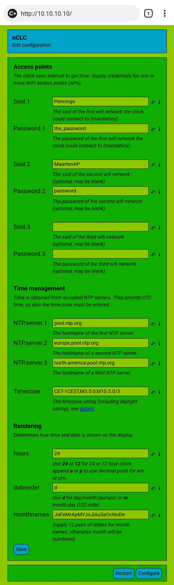

# The new clock firmware

New firmware for the ESP8266 based _303 WIFI LC 01 clock_.

## nCLC - a basic NTP clock

A basic NTP clock [nCLC](nCLC) is available. 
Features:

 - Pressing button SET brings the clock in configuration mode.
   In configuration mode, it becomes an access point and webserver.
   Via the webserver one can program the SSID/PASSWD of the home network, the **timezone**,
   and how time and date is rendered.
 - During normal operation, pressing DOWN steps the display brightness.
 - During normal operation, pressing UP toggles time and date.

In configuration mode, connect to the access point created by the nCLC,
named something like `nCLC-234C66`, then browse to 10.10.10.10 and start configuring.
The `Timezone` is the hardest field, its syntax is explained
in the [GNU manuals](https://www.gnu.org/software/libc/manual/html_node/TZ-Variable.html).

(end)

