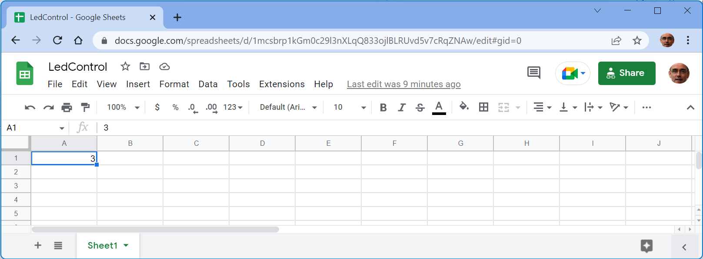
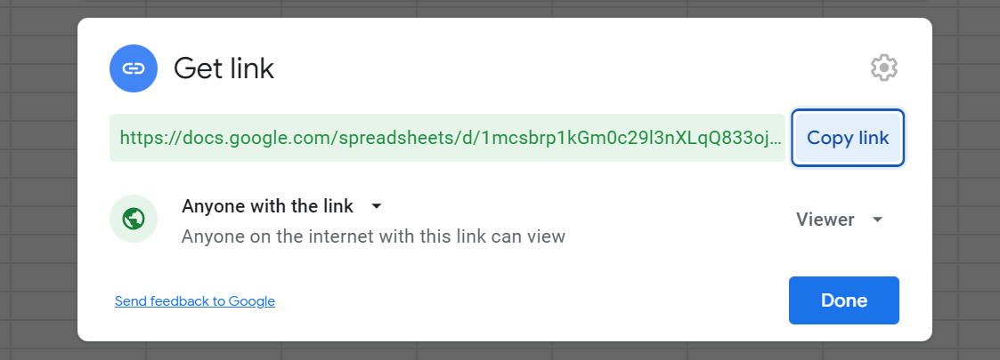
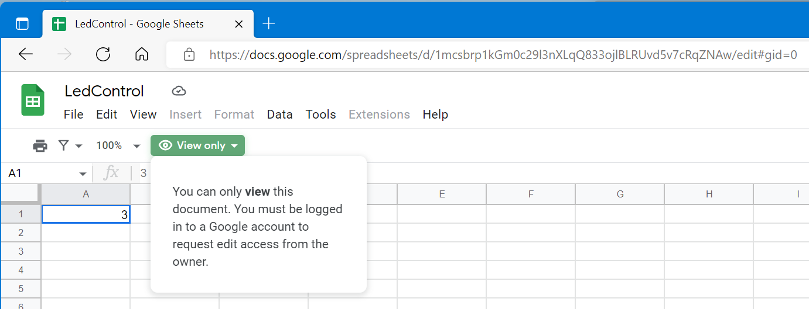

# Web configuration

## Introduction

Many ESP8266 applications need some configuration.
There are several approaches:

- Hard code them in the source code. Seen often are `#define`s with `SSID` and `PASSWORD`.
- Store them in local EEPROM or flash file system
- Have a web interface to configure the EEPROM or file, e.g. see my [Cfg](https://github.com/maarten-pennings/cfg) library.

This experiment adds one more.
Store the configuration on a public web server and let the ESP8266 load that.
This is especially useful when the amount of information is larger, and needs to be updated modestly frequently.
I needed this for a list of birthdays for a clock that signals there is a party.

There are some consideration for choosing where and how to store the configuration file.

- Easiest would be to store the file on a plain `http` server, however `https` is the norm these days.
  We need to add an SSL library to the ESP firmware.
- Easiest would be to have a server which doesn't need log-in, 
  otherwise we would have to add an authentication library and login credentials to the ESP firmware.
- Easiest would be to free-ride on existing services like `github` or `google docs`.
  Files on `github` are publicly readable (easy for the ESP), but also very publicly visible (everyone can find them), 
  and every change needs a commit. A `google docs` file can be made publicly readable 
  ("share public by anyone with link"), but as long as the link is kept private, the file is "unfindable".
  No commits needs for changes.
- Easiest would be to have a plain _text_ file, because we need to load and parse the file on the ESP.
  So a `github` text file sounds good, but we found that a google spreadsheet can be downloaded as CSV, 
  which is also good.

Conclusion: A publicly shared google spreadsheet, editable by the owner, downloaded as CSV by the ESP, is the chosen solution.

It appeared that there is one additional complexity for this solution: 
a google docs URL gets a temporary redirect URL every time we access it. This makes the ESP firmware a bit harder.


## Preparing the spreadsheet

- It is assumed you have a google account.
- With your browser go to [sheets.google.com](https://docs.google.com/spreadsheets) and log in with your google account.
- Click the tile with the big four-colored plus to start a new "blank" sheet.
- In the upper left corner click "Untitled spreadsheet" to rename it to e.g. `LedControl`.
- In cell A1 type e.g. `3`; this will become 3 flashes per cycle on the ESP8266.

  
  
- Record the URL of the sheet, in my case that is
  `https://docs.google.com/spreadsheets/d/1mcsbrp1kGm0c29l3nXLqQ833ojlBLRUvd5v7cRqZNAw/edit#gid=0`.
  Two number are important, the long number in the middle `1mcsbrp1kGm0c29l3nXLqQ833ojlBLRUvd5v7cRqZNAw` and the 
  short number at the end (after gid) `0`. The long number identifies the spreadsheet, the short number the tab.
  The short number is `0` for the first tab of a spreadsheet, but subsequent tabs have wilder numbers like `1520656455`.
- This spreadsheet will only be accessible with your google account.
  It is not nice to have to enter your google credentials in the ESP8266 firmware.
  Instead we make the spreadsheet _public_: click the green Share button in the upper right corner.
  Two windows pop up: the top one to share the file with people by name. 
  We need the bottom one to share with "Anyone with the link".
  
  
  Click the lower one, and for a bit of added safety ensure "Viewer" access rights (no writes)
- We do not need to "Copy link", because the URL is similar to the long and short number above, and we need to tweak it anyhow.
  So, we are done, and we can close the browser.

The URL we will use (download tab as CSV) is then

> `https://docs.google.com/spreadsheets/d/` [long number] `/export?format=csv&gid=` [short number]

I found this via the File > Download > Comma Separated Values (and having developer console open to capture the URL).

In our case the URL would be

> `https://docs.google.com/spreadsheets/d/1mcsbrp1kGm0c29l3nXLqQ833ojlBLRUvd5v7cRqZNAw/export?format=csv&gid=0`

Try it out by clicking this [link](https://docs.google.com/spreadsheets/d/1mcsbrp1kGm0c29l3nXLqQ833ojlBLRUvd5v7cRqZNAw/export?format=csv&gid=0) 
to mimic the ESP and download the CSV. 

If you have `wget` on your machine you can also try it on the command line.

```bash
maarten@Desktop-Maarten MINGW64 ~/Desktop
$ wget -O LedControl.csv  https://docs.google.com/spreadsheets/d/1mcsbrp1kGm0c29l3nXLqQ833ojlBLRUvd5v7cRqZNAw/export?format=csv&gid=0
[1] 200
--2022-05-28 14:06:24--  https://docs.google.com/spreadsheets/d/1mcsbrp1kGm0c29l3nXLqQ833ojlBLRUvd5v7cRqZNAw/export?format=csv
Resolving docs.google.com (docs.google.com)... 2a00:1450:400e:800::200e, 216.58.214.14
Connecting to docs.google.com (docs.google.com)|2a00:1450:400e:800::200e|:443... connected.
$ HTTP request sent, awaiting response... 307 Temporary Redirect
Location: https://doc-0o-34-sheets.googleusercontent.com/export/70cmver1f290kjsnpar5ku2h9g/gfce54o8cnspr5j501hoatcpmc/1653739585000/100551271971078898148/*/1mcsbrp1kGm0c29l3nXLqQ833ojlBLRUvd5v7cRqZNAw?format=csv [following]
Warning: wildcards not supported in HTTP.
--2022-05-28 14:06:25--  https://doc-0o-34-sheets.googleusercontent.com/export/70cmver1f290kjsnpar5ku2h9g/gfce54o8cnspr5j501hoatcpmc/1653739585000/100551271971078898148/*/1mcsbrp1kGm0c29l3nXLqQ833ojlBLRUvd5v7cRqZNAw?format=csv
Resolving doc-0o-34-sheets.googleusercontent.com (doc-0o-34-sheets.googleusercontent.com)... 2a00:1450:400e:80f::2001, 142.251.39.97
Connecting to doc-0o-34-sheets.googleusercontent.com (doc-0o-34-sheets.googleusercontent.com)|2a00:1450:400e:80f::2001|:443... connected.
HTTP request sent, awaiting response... 200 OK
Length: unspecified [text/csv]
Saving to: 'LedControl.csv'
2022-05-28 14:06:25 (98.6 KB/s) - 'LedControl.csv' saved [1]

maarten@Desktop-Maarten MINGW64 ~/Desktop
$ cat LedControl.csv
3
```

This results in a file `LedControl.csv`, which contains a single line with content `3`.
We also see that `wget` did need two GETs. The first to `docs.google.com`, our original URL, 
and the second to `doc-0o-34-sheets.googleusercontent.com` for the temporary redirect flagged by the first.


By the way a similar URL (`edit` instead of `export` at the end) `https://docs.google.com/spreadsheets/d/1mcsbrp1kGm0c29l3nXLqQ833ojlBLRUvd5v7cRqZNAw/edit#gid=0`
will open [google docs](https://docs.google.com/spreadsheets/d/1mcsbrp1kGm0c29l3nXLqQ833ojlBLRUvd5v7cRqZNAw/edit#gid=0), 
in "View only" mode, because that's how we configured this share URL.




## The firmware

I have written a proof of concept firmware [webcfgled](webcfgled) that constantly 
(every 10 seconds) reads the spreadsheet from the google docs server.

If that fails it will flash the built-in LED 5 times very rapidly.

If it succeeds downloading the file and parsing the number `x` on cell A1, 
it will flash the built-in LED 1 time very rapidly, and then `x` times very slowly.

This is a session where I change cell A1 of the spreadsheet while the firmware is running.

```text
Welcome to webcfgled

led   : init
wifi  : connecting ..........
wifi  : connected 192.168.179.154

webcfg: 2
webcfg: 2
webcfg: 5
webcfg: 5
webcfg: 5
webcfg: 2
webcfg: 2
webcfg: 2
webcfg: 3
```

(end)

