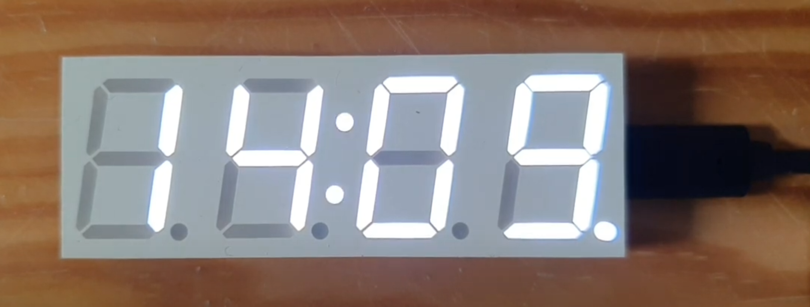

# Birthday clock

New firmware for the ESP8266 based _303 WIFI LC 01 clock_.

## Introduction

The video below shows a clock from Ali Express. It is driven by an ESP8266. 
I replaced the firmware, now it is NTP synced, and it reads a birthday calendar 
from Google sheets. The lower right 'decimal point' of the display is on, 
indicating there is a birthday this week. 
Every 5 minutes, a message scrolls telling in how many days the birthday is (3 in the video),  
whose birthday it is (John's), and how old (s)he will be (21).

## bCLC firmware

See the [Arduino](bCLC) project for the new firmware: birthday clock.

If you compile yourself, chose "Generic ESP8266 module" as board in the Arduino IDE, 
otherwise the EEPROM layout will not match the hardware.

(end)

