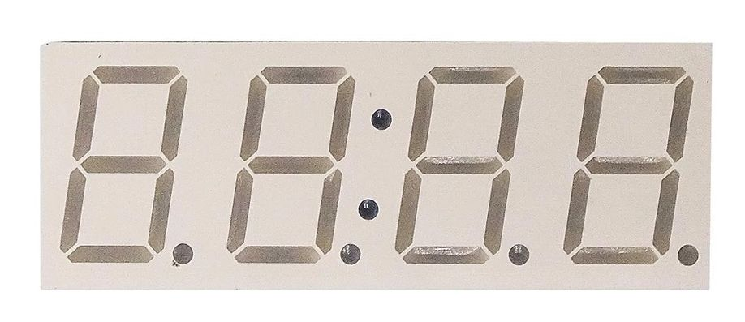
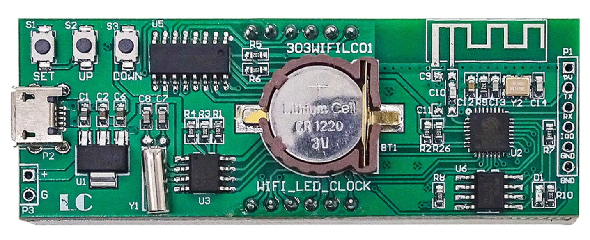

# 303WIFILC01 Clock

Home brew firmware for the ESP8266 based _303 WIFI LC 01 clock_.

## 1. Board analysis

I did a first analysis of the board.
Find my findings in subdirectory [pcbnets](1-pcbnets).

## 2. Backup of original firmware

The goals is to make our firmware and flash that on the board.
I made a backup of the original firmware, see subdirectory [fwbackup](2-fwbackup), just in case.

This proves that we can communicate with the internal bootloader, so that we can also upload our own firmware.

## 3. Flashing a test

With the backup made, let's see if we can flash our own
[firmware](3-flash).

## 4. The display

The firmware illuminated unexpected segments. Time to analyze the
[display](4-display).

(end)

